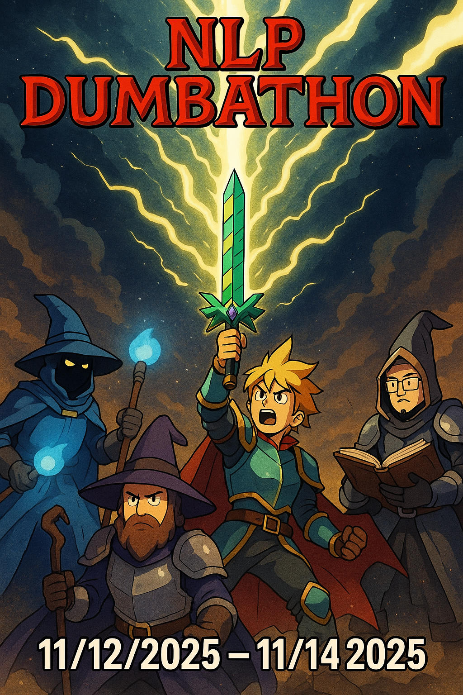

# NLP + HCI Hackathon (Dumbathon)

> Image was made pre HCI addition sorry fam

Dumbathon? Yes, Dumbathon.

Using your NLP, Comp Sci, Stats, or even Linguistic knowledge you will need to make something dumb, silly, fun, or outright annoying.

Something you would never actually want to see in the wild.

Inspired by events like [this](https://bostonstupidhackathon.com/) or [this](https://stupidhackathon.github.io/).

The Dumbathon will be taking place from **11/12/2025** to **11/14/2025**. With two asynchronous days to develop your project, and a final in person work / celebration day with a judging panel.
> There will likely also be snacks

## Why would I do this?

That is an excellent question! Maybe because you are cool! Or even because you are awesome!

The main focus of this event is to build a stronger community in the NLP cohorts. We want to remove any kind of pressure and just enjoy our time together.

## Prizes

The prizes are the friends you will make along the way. Maybe even some extra NLP merch we have laying around in an office somewhere ;).

**A Super Awesome Secret Prize** made by one of NLP's brightest stars (Karthik) will be given to the first place winners.

I don't want to give away what it is, but imagine what the best prize for a dumbathon could be, and then multiply that by 100.

## Judging

It is with immense pride I am happy to announce that the man himself **Jeffery Flanigan** will be one of our judges. A no brainer for NLP representation.
We will also be inviting faculty from the SVC outside of the NLP program to partake in judging. The amazing men and women of the front desk, and mantainence staff.

Judging is still being sorted out but for sure Jeff will be one.

### Judging Criteria

- Laughs
- Uselessness
- Something mind bendingly stupid
- Vibes for sure

## Logitstics

### Dates

The hackathon will take place between **11/12/2025** to **11/14/2025**.

The first two days will be a little more loosey goosey, allowing for some asynchronous work. With the final day being the big event in person on campus.

### Teams

Teams will be a mix between 1st, and 2nd years. All teams will be randomly generated to foster making new connections.
We will do our best to ensure teams have a reasonable amount of both cohorts represented.

